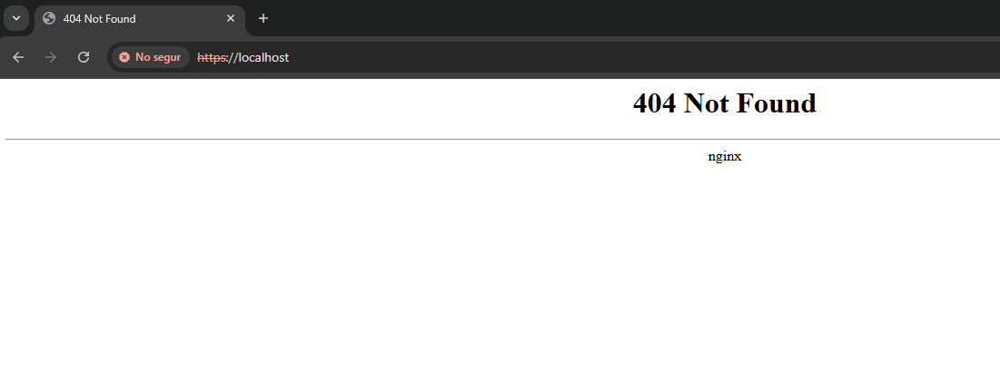
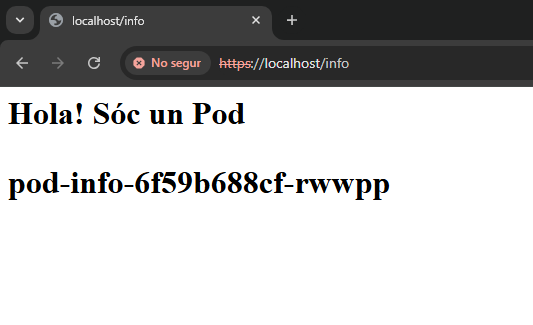
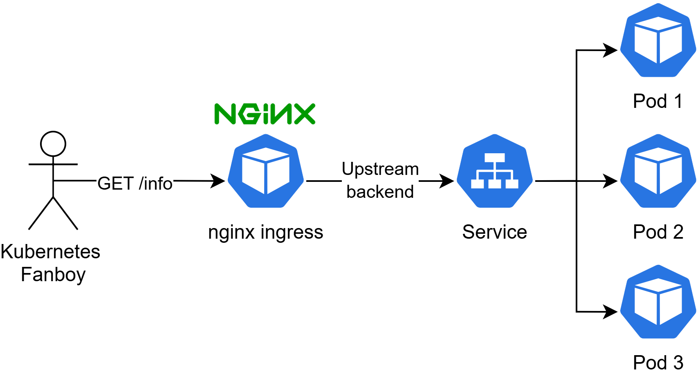
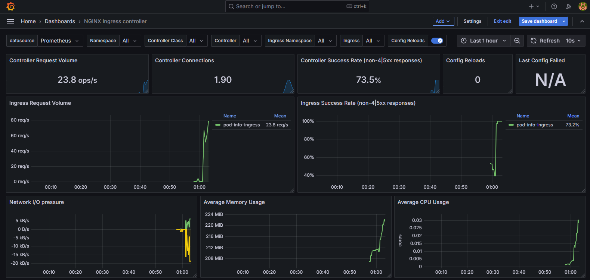
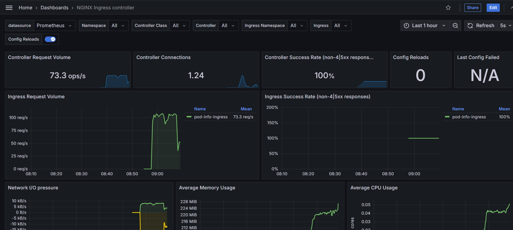

# POC Kubernetes (K8s)

## Instal·lació de Kubernetes en Local

Abans de començar amb el PoC, instal·larem un clúster de Kubernetes en Local. La manera més fàcil de fer-ho és amb [Kind](https://kind.sigs.k8s.io/docs/user/quick-start/). Aquest binari ens permet crear un clúster format per un o més nodes, que al host s'executen en contenidors `Docker`.

### Requisits
* Instal·lar `Docker` (https://docs.docker.com/engine/install/ubuntu/)
* Instal·lar `kubectl` per interactuar amb el clúster
    ```bash
    curl -LO "https://dl.k8s.io/release/$(curl -L -s https://dl.k8s.io/release/stable.txt)/bin/linux/amd64/kubectl"
    sudo install -o root -g root -m 0755 kubectl /usr/local/bin/kubectl
    rm ./kubectl
    ```

### Instal·lació de Kind
Instal·larem `Kind` seguint la guia oficial (https://kind.sigs.k8s.io/docs/user/quick-start/#installing-from-release-binaries)

```bash
# For AMD64 / x86_64
[ $(uname -m) = x86_64 ] && curl -Lo ./kind https://kind.sigs.k8s.io/dl/v0.25.0/kind-linux-amd64
chmod +x ./kind
sudo mv ./kind /usr/local/bin/kind
```

### Creació del clúster

Crearem un clúster a partir de la configuració [./local-cluster.yaml](./local-cluster.yaml), definint 2 nodes, 1 control plane i 1 worker

```bash
kind create cluster --config local-cluster.yaml
```

Si tot ha funcionat bé, hauríem de poder interactuar amb el clúster mitjançant l'eina de `kubectl`. 
* Per exemple, podem llistar els 2 nodes del clúster (control-plane + worker):
    ```bash
    kubectl get node
    ```

### Instal·lació de nginx-ingress
Per poder exposar els serveis fàcilment, aixecarem [nginx-ingress](https://github.com/kubernetes/ingress-nginx). Aquest, desplegarà un `reverse proxy` basat en `nginx`, que Kubernetes reconfigurarà de manera dinàmica per exposar els serveis interns (mitjançant recursos [`Ingress`](https://kubernetes.io/docs/concepts/services-networking/ingress/))

```bash
kubectl apply -f base-software/nginx-ingress-controller.yaml
```
Amb la següent comanda esperarem fins que el component s'hagi desplegat correctament

```bash
kubectl wait --namespace ingress-nginx \
  --for=condition=ready pod \
  --selector=app.kubernetes.io/component=controller \
  --timeout=90s
```
Si tot ha anat bé, hauríem d'observar que el `Pod` de `Nginx Ingress` s'ha desplegat correctament

```bash
$ kubectl get deploy -n ingress-nginx

NAME                       READY   UP-TO-DATE   AVAILABLE   AGE
ingress-nginx-controller   1/1     1            1           2m56s
```

A més si accedim a `https://localhost`, hauria de respondre el reverse proxy amb un error 404, ja que no tenim cap recurs exposat

```bash
$ curl -k -I https://localhost
HTTP/2 404 
date: Mon, 25 Nov 2024 22:05:20 GMT
content-type: text/html
content-length: 146
strict-transport-security: max-age=31536000; includeSubDomains
```


## Desplegament de l'aplicació

Per fer un exemple pràctic, desplegarem una aplicació web que retornarà el nom del pod que ha processat la petició `http`. Farem servir la imatge [`hashicorp/http-echo`](https://github.com/hashicorp/http-echo).

Amb la següent comanda desplegarem tots els manifests de la carpeta `./deploy-stack` (Deployment + Service + Ingress)

```bash
kubectl apply -k deploy-stack
```
Observem que el desplegament [./deploy-stack/deployment.yaml](./deploy-stack/deployment.yaml) aixecarà 3 rèpliques horitzontals:

```yaml
apiVersion: apps/v1
kind: Deployment
metadata:
  name: pod-info
spec:
  replicas: 3
...
```

Podem verificar que les 3 rèpliques s'han aixecat correctament
```bash
$ kubectl get pod -o wide
NAME                        READY   STATUS    RESTARTS   AGE
pod-info-6f59b688cf-4457c   1/1     Running   0          19m
pod-info-6f59b688cf-rwwpp   1/1     Running   0          19m
pod-info-6f59b688cf-t5b94   1/1     Running   0          19m
```

De fet, també hem inclòs un recurs `Ingress` que exposa el servei `pod-info` a l'exterior mitjançant el `reverse proxy nginx` que hem instal·lat abans:

```bash
kubectl get ingress -o wide
```
i podem veure que segons la configuració de l'Ingress aquest s'exposa a l'exterior amb el path: `https://locahost/info`

```bash
$ kubectl describe ingress/pod-info-ingress
...
Rules:
  Host        Path  Backends
  ----        ----  --------
  localhost   
              /info   pod-info-svc:3000 (10.244.1.19:3000,10.244.1.20:3000,10.244.1.21:3000)
...
```
Per tant, si accedim a `https://localhost/info` estarem accedint a un dels pods del desplegament, tal com s'indica al hostname.



Si refresquem la pàgina veurem que **ens respon un pod diferent**, ja que el servei fa una distribució `Round-Robin` de les peticions. El següent esquema descriu la ruta que segueix el tràfic de xarxa dins del clúster



En aquest punt podem jugar amb el mecanisme de resiliència inclòs a Kubernetes, que intentarà sempre mantenir el nombre de rèpliques definit al deployment (en aquest cas 3). **Esborrarem pods de forma intencionada** per veure com respon Kubernetes.

* Primer observarem en temps real el nombre de pods que tenim desplegats. Obrirem una terminal nova i escoltarem els canvis en temps real

```bash
watch -n 1 'kubectl get pods -l app=pod-info'
```
A continuació, en una terminal diferent, matarem un pod aleatori del deployment

```bash
kubectl delete $(kubectl get pods -l app=pod-info -o name | shuf -n 1)
```
Observeu com en el moment que s'elimina un Pod, Kubernetes automàticament aixeca una rèplica nova amb un identificador diferent.

A més, podem modificar sota demanda el nombre de rèpliques del Deployment, per adaptar-nos a càrregues puntuals de tràfic. A continuació aixecarem 2 rèpliques més

```bash
kubectl scale --replicas=5 deployment/pod-info
```
Veureu com automàticament Kubernetes aixeca 2 pods més

```txt
Every 1.0s: kubectl get pods -l app=pod-info                                                                           bouman: Tue Nov 26 00:16:50 2024

NAME                        READY   STATUS    RESTARTS   AGE
pod-info-6f59b688cf-htzsk   1/1     Running   0          3m52s
pod-info-6f59b688cf-qzwq9   1/1     Running   0          5s
pod-info-6f59b688cf-rwwpp   1/1     Running   0          47m
pod-info-6f59b688cf-t5b94   1/1     Running   0          47m
pod-info-6f59b688cf-w2d7x   1/1     Running   0          5s
```

També podem reduir el nombre de rèpliques! Deixarem només 2 de moment

```bash
kubectl scale --replicas=2 deployment/pod-info
```

## Monitorització

### Requisits
* `Helm`: Gestor de paquets de Kubernetes
    ```bash
    curl -fsSL -o get_helm.sh https://raw.githubusercontent.com/helm/helm/main/scripts/get-helm-3
    chmod 700 get_helm.sh
    ./get_helm.sh
    ```

Part de la gràcia de Kubernetes resideix en la facilitat amb la qual podem desplegar stacks d'aplicacions i configurar automatitzacions concretes. A continuació, desplegarem un stack de monitorització bàsic per capturar les mètriques del `Nginx Ingress` que fa de `reverse proxy` a la nostra aplicació. Mitjançant aquest, podrem observar el nombre de peticions que ens arriben al clúster, i mètriques de rendiment associades.


* Definim el Dashboard que farem servir per visualitzar les mètriques de nginx ingress

```bash
kubectl create ns monitoring
kubectl apply -f monitoring/dashboard-nginx.yaml -n monitoring
```

* Despleguem el stack de monitorització [Kube-Prometheus-Stack](https://github.com/prometheus-community/helm-charts/tree/main/charts/kube-prometheus-stack)

```bash
helm repo add prometheus-community https://prometheus-community.github.io/helm-charts
helm repo update
helm install kube-prometheus-stack prometheus-community/kube-prometheus-stack -f ./monitoring/values-kps.yaml -n monitoring --create-namespace
```

* Despleguem el recurs per capturar les mètriques de `nginx-ingress`

```bash
kubectl apply -f monitoring/service-monitor.yaml
```

* Fem un `port-forward`amb kubectl per accedir a Grafana fàcilment mitjançant el port 3000. **Aquesta comanda bloqueja la consola!**, creará un tunnel per atacar `grafana` directament via `localhost:3000`

> Potser triga una mica en aixecar-se tot el stack de monitorització. Pots revisar que tots els pods s'han creat i es troben en estat running `kubectl get pod -n monitoring`.

```bash
kubectl port-forward svc/kube-prometheus-stack-grafana -n monitoring 3000:80
```
Accedim via `http://localhost:3000` i fem login:

```txt
username: admin
password: prom-operator
```
Si tot ha funcionat bé, sota `Home > Dashboards > NGINX Ingress Controller`. Hauríem de veure el dashboard del `reverse proxy nginx-ingress`.



Podem generar tràfic sintètic cap al desplegament `pod-info` amb `curl`

```bash
for i in {1..100000}; do curl -s http://localhost/info > /dev/null; done
```

Si anem refrescant el dashboard, veurem que el tràfic del `ingress` anomenat `pod-info-ingress` incrementa.



## CleanUP

```bash
kind delete cluster
```

